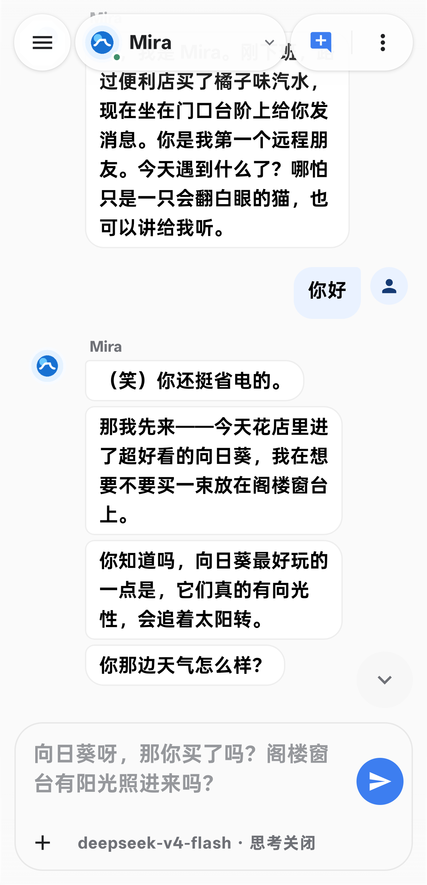
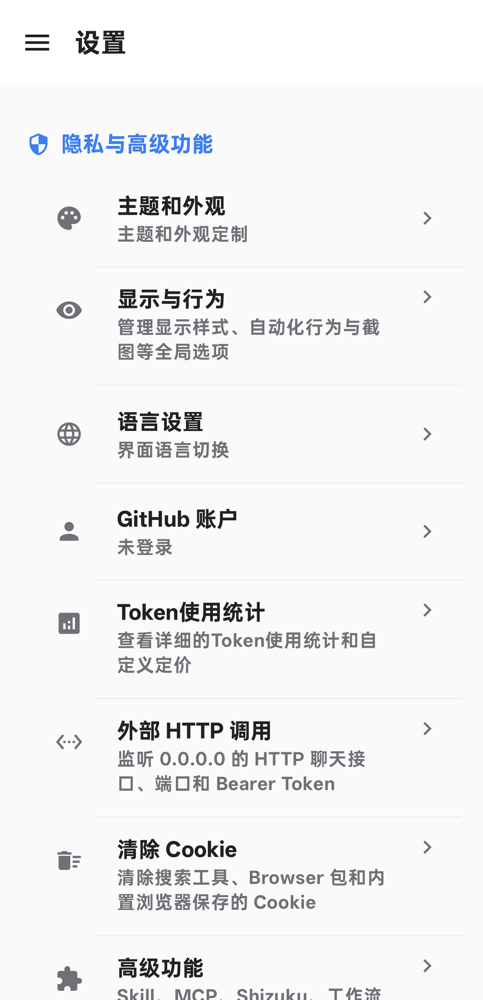

# Mira

<div align="center">
  <br>
  <strong>A local-first AI companion for Android</strong><br>
  Conversation, memory, companionship, and control, with full Agent capabilities when needed
</div>

<div align="center">
  <a href="README.md">Chinese</a> ·
  <a href="https://kernelx30.github.io/Mira/">User Guide</a> ·
  <a href="https://kernelx30.github.io/Mira/plugin.html">Plugin Development</a> ·
  <a href="https://github.com/kernelx30/Mira/releases">Releases</a> ·
  <a href="https://github.com/kernelx30/Mira/issues">Issues</a> ·
  <a href="https://github.com/AAswordman/Operit">Upstream Operit</a>
</div>

<div align="center">
  
  
  
  
  
</div>

> [!IMPORTANT]
> Mira is currently in the `0.1.x` release-candidate phase. Only APKs published in this repository's Releases with the project's retained signing key are official builds.

> [!TIP]
> [Join the Mira QQ community group](https://qun.qq.com/universal-share/share?ac=1&authKey=T1QUgCwcBvZgzJ8p%2B1cG723go8dbe8EtOC35wtUQiFkjoyg88AfApHet%2F6VerSL2&busi_data=eyJncm91cENvZGUiOiIxMDcwMTUzODA5IiwidG9rZW4iOiJ3WlBoa3BRNVFxQ3dEVC9ld0JDNTNoY3d1QlNyMnRlR3gvdlhZNEtZbUFrc2UxQ1JUeFZhb1Q2dGFmRUpDY0xYIiwidWluIjoiNDgyNzM0MTE5In0%3D&data=QaDcQk3MDx_wS59qrWDZXsmhCGW7cSQq_JR31WvZfb5cGWQtn1PnwSW3Asblpq4zaqyuUmAh0WiFSHjUVphX2A&svctype=4&tempid=h5_group_info), group number: `1070153809`. In the app, open `Settings → Community and Project → Join Mira Home`.

> [!TIP]
> **Recommended API relay: [HackerX30](https://hackerx30.com)**
> Use HackerX30 to power Mira's everyday conversation, memory extraction, and reply suggestions with GPT-5.6 at a very low rate. Add the API Key, Endpoint, and model ID supplied by the platform under Mira's Model and API settings.

## What Mira Is

Mira is an Android AI companion created through a substantial redesign of [Operit](https://github.com/AAswordman/Operit). It inherits Operit's model integrations, tool calling, local runtime, and extension ecosystem, but reorganizes the product around one path:

```text
Conversation
  -> chapters and summaries
  -> memory proposals, evidence, and relationships
  -> context for the next turn
  -> proactive messages, reminders, and voice companionship
```

The four product priorities are:

```text
Conversation -> Memory -> Companionship -> Control
```

The application ID is `com.ai.assistance.mira`, so Mira can be installed alongside upstream Operit. Source code, Issues, Releases, update checks, and the static market all point to `kernelx30/Mira`.

## Mira vs. Operit

This is not a simple rebrand. The projects share a large technical foundation, but their default user journeys are different.

| Area | Operit foundation | Mira direction |
|---|---|---|
| Primary entry | Agent tools, workspaces, and automation | Character conversation first; tools appear when the task needs them |
| Information architecture | A broad, tool-oriented feature surface | A focused chat flow; complex controls live under advanced settings |
| Conversation | Full model and tool-call pipeline | Adds request recovery, conversation race protection, full-text history search, and immersive multi-bubble replies |
| Memory | Existing memory, knowledge-base, and graph foundations | A separate companion-memory store with user, companion, relationship, and conversation scopes |
| Voice | Multiple TTS and STT providers | Adds expressive direction, segmented queues, spoken-text progress, interruption, and text-first delivery |
| Proactivity | Workflows, schedules, and background tasks | Uses recent conversation, commitments, and relationship context for proactive messages |
| Floating UI | Desktop-pet and floating-workbench capabilities | A small companion bubble and compact quick-reply card |
| App control | Settings are primarily changed page by page | Adds a conversational settings tool for searching, reading, and changing conversation, companion, and global settings |
| Extensions | Operit market, Skill, MCP, and ToolPkg | Mira market and MiraForge for new publishing, while retaining OperitForge compatibility |
| Migration | Chat, configuration, and database backup foundations | Adds a unified memory archive, raw snapshots, scheduled Room backups, and supported Operit chat-backup import |
| Releases | Operit package, repository, and update channel | Independent app ID, branding, GitHub Releases, and update source |

Mira continues to track reusable upstream fixes and preserves compatible protocols. Compatibility does not merge the two release channels or product identities.

## Screenshots

<div align="center">
  
  
</div>

## Core Capabilities

### Conversation and Characters

- Character-based chat, streaming output, summaries, search, archive, and export
- Immersive replies that may use one or several bubbles based on the content
- Per-conversation model, reasoning, context-window, and memory controls
- Tool execution traces, error recovery, and conversation-switch protection
- Independent character avatars, personas, voice notes, capabilities, and memory boundaries
- Group conversations in which each character retains its own profile

### Voice and Presence

- Configurable Doubao, MiniMax, MiMo, OpenAI, Deepgram, SiliconFlow, HTTP, and local voice providers
- An expressive TTS director that maps emotion, style, pace, and pitch to each provider's actual capabilities
- Streaming text published before queued voice playback
- Current-segment highlighting, pause and stop controls, and interruption on new messages
- Proactive reminders, notifications, voice sessions, a companion bubble, and quick replies

### Conversational Settings, Extensions, and Migration

- `manage_mira_settings` can search, read, and change real settings from requests such as “enable auto-read” or “set expressive speech to vivid”
- Conversation overrides, current-companion preferences, and global defaults are persisted as separate scopes
- API keys, destructive resets, import replacement, Android permissions, and the overlay service are excluded from the general settings tool
- The extension manager covers scripts, ToolPkg, Skill, and MCP; ToolPkg containers, subpackages, and per-companion capability grants remain explicit
- Mira's market tracks public metadata and source repositories, publishes new artifacts to the user's own `MiraForge`, and recognizes compatible Operit resources
- Backup tools cover chats, character cards, model configurations, structured memory, Room databases, and raw snapshots, including supported Operit chat-backup import

### Agent and Advanced Features

- Tool calling is available when a task needs it, without a separate chat-only mode
- Skill, MCP, script, ToolPkg, workflow, and knowledge-base support
- Files, terminal, SSH/SFTP, workspaces, web access, and deep search
- Shizuku, Accessibility, Root, AutoGLM, and virtual-screen device assistance
- MNN and llama.cpp/GGUF local-model modules
- Tasker, broadcast, and local HTTP integration points

## Companion Memory

Mira keeps raw chat history separate from long-term memory. Chat history records what happened; long-term memory contains facts, events, preferences, boundaries, commitments, and relationship state that may matter later.

### Four Memory Scopes

| Scope | Content | Default visibility |
|---|---|---|
| `USER` | Stable user identity, global preferences, and general boundaries | Available to all companions |
| `COMPANION` | A companion's own profile and private knowledge | That companion only |
| `RELATIONSHIP` | Names, shared experiences, commitments, and relationship state | That user-companion pair only |
| `CONVERSATION` | Summaries, chapters, active topics, and unfinished threads | Current conversation participants only |

The data layer can grant or revoke another companion's `READ` access to an individual memory. Private companion and relationship memories are not silently shared when the active character changes.

### Per-Turn Processing

```text
response completed
  -> persist raw messages
  -> queue the turn as a memory candidate
  -> propose CREATE / UPDATE / SUPERSEDE / LINK / IGNORE
  -> validate subject, scope, evidence, duplicates, conflicts, and sensitive content
  -> update Room, full-text indexes, and relationship edges
  -> retrieve current relevant memories before the next response
```

Every completed turn can be evaluated, but ordinary chatter, duplicates, and low-value content may produce `IGNORE`. Each stored memory can retain source conversation, message, speaker, quote, and timestamp evidence.

Memory states include `ACTIVE`, `ARCHIVED`, `SUPERSEDED`, and `DELETED`. A corrected fact creates a new version linked to the previous record instead of silently overwriting history. Current responses prefer active facts; historical versions remain traceable.

The memory database is protected by the Android application sandbox. It is not a cloud synchronization service or an end-to-end encrypted vault. Treat exported backups as sensitive files.

## Market and Compatibility Layer

Mira reads its own static market endpoint:

```text
https://kernelx30.github.io/Mira/market/v2/
```

GitHub sign-in uses OAuth Device Flow: Mira displays a one-time user code and the user completes authorization on GitHub in the system browser. Public APKs contain only a public Client ID, never a Client Secret, and do not use a callback WebView. The resulting token is sent only to `github.com` and `api.github.com`.

New artifacts are uploaded to the user's own `MiraForge` and registered through a GitHub Issue in `kernelx30/Mira`, using the stable ID `mira-<issueNumber>`. Comments, reactions, and management use GitHub Issues, Comments, and Reactions. Existing Operit market entries are exposed through a read-only Mira Pages mirror and continue downloading from their original repositories or Releases; Mira does not send its GitHub token to the legacy market service.

The following internal identifiers are intentionally retained for compatibility:

- The `com.ai.assistance.operit` Kotlin/Java namespace
- `.operit/market.json` installation markers
- Existing JS Bridge, ToolPkg, Skill, and MCP protocol fields

Renaming these identifiers globally would break extensions, serialized data, database migrations, and third-party integrations.

## Privacy and Security Boundaries

"Local-first" means that the device owns the default data store. It does not mean that cloud-backed features keep all data on the phone.

| Feature | Data destination |
|---|---|
| Chat history, character profiles, relationships, and memory | Android app-private storage, or a location explicitly selected for export |
| Cloud LLM | Current message, system prompt, selected history, relevant memories, attachments, and tool results go to the configured endpoint |
| Cloud TTS | Text, voice, and style parameters go to the selected voice provider |
| Cloud STT | Audio segments and recognition parameters go to the selected speech provider |
| Search, MCP, Skill, and ToolPkg | Queries, tool arguments, selected files, or task context may go to the configured service |
| Local models and local voice | Inference can remain on-device; networked tools still follow their own endpoints |
| GitHub sign-in and market interaction | Device Flow, MiraForge publishing, Issue registration, comments, and reactions use GitHub domains only |

Important boundaries:

- Mira does not require a project-owned chat relay; cloud requests go to the endpoint configured by the user
- GitHub sign-in does not embed a Client Secret in the APK; its token is used only with GitHub APIs and is not sent to the Operit market service
- API keys live in app-private data, but configuration exports and full backups may include keys, headers, and endpoints
- Exported backups are not automatically encrypted and must be handled as sensitive files
- Microphone, location, overlay, Accessibility, Shizuku, and Root permissions are feature-specific; basic text chat does not need all of them
- Extensions operate within the file, network, terminal, and device capabilities granted to them
- Use separate, revocable, budget-limited API keys and configure provider-side spending alerts

See [PRIVACY.md](PRIVACY.md) and [SECURITY.md](SECURITY.md) for the full policy.

## Quick Start

1. Download a project-signed APK from [Releases](https://github.com/kernelx30/Mira/releases).
2. Grant only the basic permissions needed for the feature you are setting up.
3. Open `Settings -> Models and API`, create a chat model configuration, and test the connection.
4. Send a short message and verify that streaming text completes normally.
5. Configure characters, memory, and TTS next; enable terminal, Shizuku, MCP, and other advanced features last.

The complete Chinese walkthrough is available at [kernelx30.github.io/Mira](https://kernelx30.github.io/Mira/).

Plugin, ToolPkg, debugging, and MiraForge documentation is available at [Mira Plugin Development](https://kernelx30.github.io/Mira/plugin.html).

## Migration from Operit

- Mira and Operit use different application IDs and can coexist
- The backup screen can recognize and import supported Operit chat backups
- Character cards, Skills, MCP servers, scripts, and ToolPkg packages retain compatible formats
- Create an Operit backup before importing, then spot-check conversations, characters, and memory in Mira
- Reconfigure API keys and high-privilege permissions in Mira instead of treating another app's private directory as a migration interface

## Build

### Requirements

- Android Studio / JDK 17
- Android SDK 36
- Android NDK and CMake
- Git submodules

### Clone and Build

```bash
git clone --recursive https://github.com/kernelx30/Mira.git
cd Mira
```

For an existing clone without submodules:

```bash
git submodule update --init --recursive
```

Use `local.properties.example` for the Android SDK, the public GitHub OAuth Client ID, and release-signing fields. Real API keys, keystores, and passwords must stay outside Git; Device Flow does not use an OAuth Client Secret.

Windows debug build:

```powershell
.\gradlew.bat :app:assembleDebug
```

Linux/macOS debug build:

```bash
./gradlew :app:assembleDebug
```

Output:

```text
app/build/outputs/apk/debug/app-debug.apk
```

Release signing, versioning, tags, and upgrade validation are documented in [docs/Mira_Release_Guide_CN.md](docs/Mira_Release_Guide_CN.md).

## Repository and Upstream

```text
origin    https://github.com/kernelx30/Mira.git
upstream  https://github.com/AAswordman/Operit.git
```

Use `origin` for Mira development and releases. Use `upstream` to track reusable Operit fixes on a dedicated sync branch. Review app IDs, database migrations, branding, update sources, memory models, and extension compatibility before merging upstream changes.

## Current Status and Limitations

- The current version line is `0.1.x`; database and interaction details are still being stabilized
- Per-memory cross-companion grants exist in the data layer, while the ordinary user-facing management flow is still being completed
- Proactive messages depend on Android background, startup, and battery policies and are not a replacement for system alarms
- Tool calling, streaming, emotion, and voice support vary across model and voice providers
- The APK is large because it includes multiple local-model and native modules
- Operit-compatible identifiers may still appear in internal paths, logs, or protocols; they are not the update source

## License and Credits

Mira is based on Operit and retains its LGPLv3 license and original copyright notices. Thanks to the Operit project and its contributors for the Agent, tool, plugin, and local-runtime foundations.

Mira-specific modifications and original components authored by `kernelx30` are copyrighted by `kernelx30`; other contributors retain the applicable rights in their own contributions. Derivative versions may be modified, renamed, and distributed under LGPLv3, but they must preserve reasonable attribution, identify modifications, and must not impersonate an official release or misrepresent Mira-specific material as another party's original work.

- Mira: [kernelx30/Mira](https://github.com/kernelx30/Mira)
- Upstream: [AAswordman/Operit](https://github.com/AAswordman/Operit)
- Authors and contributors: [AUTHORS.md](AUTHORS.md)
- Copyright notices: [NOTICE](NOTICE)
- LGPLv3: [LICENSE](LICENSE); complete GPLv3: [COPYING](COPYING)
- Attribution and origin marking: [ADDITIONAL_TERMS.md](ADDITIONAL_TERMS.md)
- Mira name and logo: [TRADEMARKS.md](TRADEMARKS.md)
