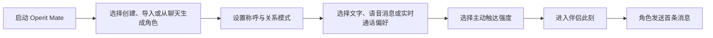
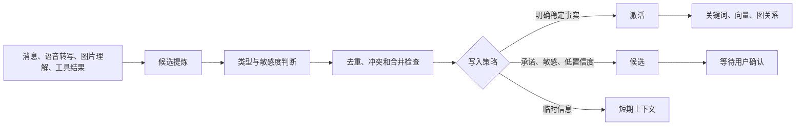
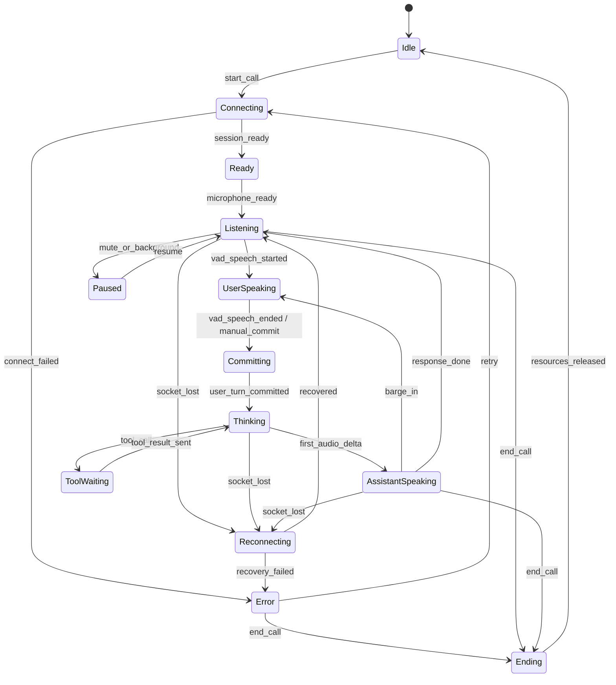
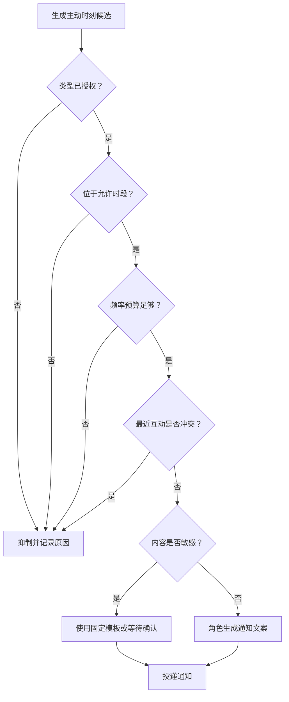
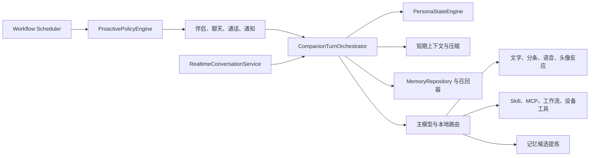

# Operit Mate 产品需求文档

## 0. 决策摘要

Operit Mate 的产品定义固定为：

> 本地优先、可成长、能说话也能做事的 Android 虚拟伴侣。

它不是独立的恋爱聊天壳，也不是给 Operit 换一套粉色主题。产品主线必须同时成立：

1. 角色具有稳定人格和可解释的关系状态。
2. 角色能形成、召回并允许用户管理长期关系记忆。
3. 文字、语音消息和实时通话共享同一个角色、关系与记忆上下文。
4. 角色可以在用户授权的时间和频率内主动出现。
5. Operit 现有 Skill、MCP、Shizuku、终端、地图、工作流、本地模型和设备能力完整保留。
6. 工具和工程信息默认隐身，只在用户需要检查时展开。

第一阶段不把 3D 虚拟人作为阻塞项。2D 头像、稳定记忆、自然通话和可靠提醒优先级更高。

## 1. 文档目的

本 PRD 用于统一产品、设计、Android、Agent、记忆、语音和测试侧的实现边界，并作为后续 Epic、Issue 和验收用例的来源。

本文件覆盖：

- 目标用户与核心任务
- 首次使用和日常用户旅程
- 五个一级页面及聊天、通话子页面
- 角色、关系和记忆数据模型
- 人格与关系状态机
- 实时语音状态机
- 主动陪伴决策流程
- 隐私、权限和数据归属
- MVP 范围、依赖、验收标准和发布门槛

## 2. 产品问题

Operit 已经具备角色卡、长期记忆、语音、头像、通知、定时任务、工作流和完整 Agent 能力，但当前能力仍以“工具和配置”组织：

- 默认入口是聊天或功能面板，缺少“角色此刻存在”的第一印象。
- 角色卡主要是 Prompt 容器，缺少结构化人格、关系规则和可持续状态。
- 记忆底座强，但用户看到的是图谱、UUID、来源字段和搜索参数，不是关系档案。
- 当前语音通话实际是连续 ASR、文本对话和分段 TTS 的组合，缺少真正全双工会话的协议和状态管理。
- 工作流和通知能主动执行，但缺少许可、安静时段和频率预算组成的统一主动策略。
- `Waifu` 配置包含分条、打字延迟、表情和自拍等有价值能力，但命名、页面结构和 Prompt 逻辑仍像旁路模式。

产品要解决的不是“再加功能”，而是把这些现成能力收束成一段连续、可理解、可控制的关系体验。

## 3. 目标与非目标

### 3.1 产品目标

- 用户首次进入 3 分钟内完成角色创建或导入，并开始第一段对话。
- 同一角色在文字、语音、浮窗和主动通知中保持一致身份与关系上下文。
- 用户能理解角色记住了什么、为什么记住、何时会被召回，并能修改或撤回。
- 用户能完成低延迟、可打断、可恢复的实时语音通话。
- 主动提醒只在用户明确许可、允许时段和频率预算内发生。
- 角色完成提醒、日历、计划、记录和工具任务时，只展示人类可读状态和结果。
- 高级用户仍能访问 Operit 的全部运行时能力和原始日志。

### 3.2 非目标

- MVP 不做完整 3D 虚拟人编辑器或大型动作资产市场。
- MVP 不做公开角色社区、关注系统和内容信息流。
- MVP 不做多端云账号体系；本地备份和手动迁移优先。
- MVP 不同时支持所有实时语音供应商；先建立统一接口并完成一个参考实现。
- 不把关系数值做成抽卡、签到或付费养成系统。
- 不通过增加通知数量、制造焦虑或虚构危机提升留存。
- 不删除或重写 Operit 的 Agent 运行时。

## 4. 目标用户与核心任务

### 4.1 用户类型

| 用户 | 主要需求 | 失败体验 |
|---|---|---|
| 日常陪伴用户 | 稳定角色、记得住、能语音、会在约定时间出现 | 人格漂移、失忆、像客服、通知骚扰 |
| 角色扮演用户 | 世界书、剧情节点、关系模式、可回滚存档 | 长对话找不到节点、剧情和现实记忆串库 |
| 效率型用户 | 陪伴表达与提醒、日历、计划、工具执行结合 | 聊天和办事是两套人格，工具日志污染对话 |
| 本地与隐私用户 | 本地模型、本地记忆、导出、可暂停、可删除 | 数据去向不清、无法检查或清空角色记忆 |
| Operit 高级用户 | Skill、MCP、Shizuku、终端、工作流继续可用 | 陪伴改版后能力被阉割或入口消失 |

### 4.2 核心用户任务

1. 创建一个有明确身份、声音和相处方式的角色。
2. 打开应用时快速知道角色状态、今天的约定和最近共同记忆。
3. 用文字、语音消息或实时通话继续同一段关系。
4. 查看、纠正、忽略或删除角色记住的内容。
5. 让角色设置提醒、做计划、记录心情或执行设备任务。
6. 控制角色是否主动出现、什么时候出现、每天最多出现几次。
7. 导出角色、关系和记忆，或彻底清空某个角色的数据。

## 5. 成功标准

指标默认在设备本地计算。任何上传型分析必须单独征得同意，并且不得包含聊天原文、音频或记忆内容。

| 指标 | MVP 目标 | 说明 |
|---|---:|---|
| 首次角色完成率 | >= 75% | 开始创建或导入后完成并进入首聊 |
| 首次有效对话率 | >= 70% | 首次进入后产生至少 4 个有效轮次 |
| 记忆可解释率 | 100% | 每条长期记忆可查看来源、时间和召回状态 |
| 记忆纠错成功率 | >= 99% | 修改、忽略、删除后下一轮不再使用旧值 |
| 角色记忆串库率 | 0 | 不同角色固定档案不得互相召回 |
| 实时通话接通率 | >= 95% | 权限和配置正确时进入 Ready 状态 |
| 打断停止延迟 | p95 <= 300 ms | 用户开口后停止角色音频输出 |
| 首段语音延迟 | p50 <= 1.5 s，p95 <= 3 s | 用户轮次提交到首段角色音频 |
| 主动触达越界率 | 0 | 不得突破关闭项、安静时段和频率预算 |
| 主动通知关闭率 | < 15% | 用于判断策略是否过度，不追求通知量 |
| Agent 任务完成可读率 | 100% | 默认对话只显示状态与结果，不显示原始日志 |

不以单纯聊天时长、通知点击数或关系依赖程度作为主成功指标。

## 6. 产品原则

1. **角色优先**：默认页面先显示角色和关系，不显示模型、Token 或权限矩阵。
2. **同一引擎**：朋友、恋人、搭档、导师、剧情角色只改变关系策略，不分裂数据与 Agent 运行时。
3. **记忆可撤回**：任何长期记忆都能找到来源、被更正、被暂停召回或删除。
4. **主动行为有预算**：模型只负责生成表达，是否发送由确定性规则决定。
5. **工具默认隐身**：参数、终端输出和原始工具结果进入展开详情或开发模式。
6. **本地优先**：能在设备完成的状态、索引、策略和媒体处理优先留在设备。
7. **渐进授权**：麦克风、通知、日历、位置、无障碍、Shizuku 和 Root 按使用时申请。
8. **失败说人话**：网络、模型、工具和权限失败转换为角色可解释状态，不伪造成功。

## 7. 信息架构

一级导航固定五项：

| 入口 | 默认内容 | 二级能力 |
|---|---|---|
| 伴侣 | 角色此刻、继续聊天、语音、今天、共同记忆 | 高密度聊天、实时通话、图片和语音消息 |
| 人设 | 当前角色、关系模式、人格摘要、声音形象 | 角色卡库、世界书、沉浸对话、高级绑定 |
| 记忆 | 关系、事件、偏好、世界档案 | 候选记忆、时间线、搜索、高级图谱 |
| 能力 | 提醒、日历、日记、计划、已授权扩展 | 工作流、Skill、MCP、Shizuku、终端、地图 |
| 我的 | 数据、隐私、模型、备份、主题 | 开发设置、日志、更新、权限管理 |

手机使用底部导航；大屏使用导航 rail。聊天和实时通话是“伴侣”的深层页面，不新增第六个一级入口。

## 8. 用户旅程

### 8.1 首次进入



要求：

- 创建流程最多三步，允许跳过头像、语音和高级人格设置。
- 默认关系模式为“搭档”或“朋友”，不得预设恋爱关系。
- 通知和麦克风权限只在用户开启主动触达或首次使用语音时请求。
- 完成后进入“伴侣此刻”，不进入会话列表或设置页。

### 8.2 日常打开应用

1. 显示当前角色、此刻状态短句和最近互动时间。
2. 显示三个主动作：继续聊天、发语音、一起做点事。
3. “今天”区域最多显示三条：约定、提醒、待追踪事项。
4. “共同记忆”显示一条可继续的话题，不自动暴露敏感记忆。
5. 用户可直接开始聊天，也可先处理提醒或查看记忆。

### 8.3 形成和纠正记忆

1. 对话结束后轻模型生成候选记忆。
2. 系统执行去重、冲突检查和类型判断。
3. 明确事实可按策略自动激活；低置信度、敏感内容和关系承诺保持候选。
4. 用户在记忆页查看来源和用途，选择确认、改正、暂时忽略或删除。
5. 修改或删除后，召回索引和关系边在同一事务中更新。

### 8.4 实时通话

1. 用户点“实时通话”，首次使用时请求麦克风权限。
2. 建立会话并注入当前角色、关系、近期上下文和有限记忆。
3. 页面进入 Listening，显示头像、声波和实时字幕。
4. 用户说话，VAD 判断轮次；角色开始流式回复。
5. 用户可随时开口打断，系统立即停止播放并取消当前模型响应。
6. 工具执行时显示一行状态，完成后角色用自然语言继续。
7. 网络断开时进入 Reconnecting；短时间恢复后继续同一会话。
8. 挂断后生成可编辑通话摘要和记忆候选，不默认保存原始音频。

### 8.5 主动陪伴

1. 用户选择主动强度、允许类型、时间窗口和角色。
2. 提醒、纪念日、长期未聊或日历事件生成“主动时刻候选”。
3. 确定性策略检查许可、安静时段、频率、最近互动和敏感内容。
4. 通过后才调用模型生成符合角色口吻的通知文案。
5. 用户点击后进入对应对话，并带入触发原因，不新开孤立会话。

### 8.6 让角色办事

1. 用户说“帮我记下明早十点交报告”。
2. 角色识别为明确任务，按角色工具白名单请求能力。
3. 工具执行过程显示“正在设置明早的提醒”。
4. 成功后显示“已设置：明天 10:00 交报告”。
5. 参数和原始工具日志仅在展开详情或开发模式显示。

## 9. 功能需求

### 9.1 伴侣首页与聊天

| 编号 | 优先级 | 需求 |
|---|---|---|
| CMP-001 | P0 | 应用默认首页为“伴侣此刻”，不是传统会话列表。 |
| CMP-002 | P0 | 首屏显示角色头像、名字、状态短句、最近互动和三个主动作。 |
| CMP-003 | P0 | “今天”聚合提醒、约定和待追踪事项，最多首屏三条。 |
| CMP-004 | P0 | “共同记忆”只展示一条可继续内容，并允许隐藏。 |
| CMP-005 | P0 | “继续聊天”进入当前角色最近会话；没有会话时创建新会话。 |
| CMP-006 | P0 | 聊天输入区不显示模型名；模型配置只在角色高级设置和“我的”出现。 |
| CMP-007 | P0 | 回复按自然语义段分条，支持打字速度、合并窗口和关闭分条。 |
| CMP-008 | P0 | 工具调用默认收为一行状态，成功和失败都给出可读结果。 |
| CMP-009 | P0 | AI 回复支持重试、继续、朗读、存为记忆、编辑分支。 |
| CMP-010 | P1 | 长按发送可选择“只聊天”或“允许使用能力”。 |
| CMP-011 | P1 | 支持图片、语音消息、相机和文件，并保持同一会话上下文。 |
| CMP-012 | P1 | 聊天顶部可查看当前关系状态和本轮召回记忆摘要。 |

### 9.2 人设与关系

| 编号 | 优先级 | 需求 |
|---|---|---|
| PER-001 | P0 | 角色卡继续作为角色身份、提示词、模型、记忆和工具绑定的基础实体。 |
| PER-002 | P0 | 人格编辑拆成核心性格、说话习惯、关系规则、兴趣、边界、世界观。 |
| PER-003 | P0 | 关系模式支持朋友、恋人、搭档、导师、剧情角色。 |
| PER-004 | P0 | 关系模式只影响话术、主动策略和剧情，不改变用户数据归属。 |
| PER-005 | P0 | 用户可设置双方称呼、纪念日、共同约定和当前关系备注。 |
| PER-006 | P0 | 声音配置按角色保存，包括供应商、voice、语速、音调和停顿风格。 |
| PER-007 | P0 | 世界书继续兼容 Tavern Character Book 导入与导出。 |
| PER-008 | P1 | 人格状态机维护当前情绪和交互姿态，并在每轮生成前注入。 |
| PER-009 | P1 | 用户可手动把角色状态切回默认，避免错误情绪长期残留。 |
| PER-010 | P1 | 高级区域保留系统提示词、模型覆盖、记忆档案和工具白名单。 |

### 9.3 关系记忆

| 编号 | 优先级 | 需求 |
|---|---|---|
| MEM-001 | P0 | 长期记忆类型为用户档案、共同经历、关系承诺、角色剧情和短期上下文。 |
| MEM-002 | P0 | 用户界面映射为关系、事件、偏好、世界四类；短期上下文不默认展示。 |
| MEM-003 | P0 | 每条长期记忆显示来源、创建/更新时间、置信度和是否自动召回。 |
| MEM-004 | P0 | 支持确认、改正、暂时忽略、禁止自动召回和删除。 |
| MEM-005 | P0 | 不同角色固定记忆档案必须隔离；群组会话需显式声明共享范围。 |
| MEM-006 | P0 | 关系承诺和敏感记忆默认进入候选状态，不直接永久激活。 |
| MEM-007 | P0 | 用户明确说“记住”时建立高优先级候选，并展示保存结果。 |
| MEM-008 | P0 | 删除或改正必须同步更新关键词、向量索引和图关系。 |
| MEM-009 | P1 | 从一段聊天或通话一键保存为剧情节点或共同经历。 |
| MEM-010 | P1 | 时间线显示相识、约定、争执、旅行、提醒完成和剧情节点。 |
| MEM-011 | P1 | 高级图谱保留搜索模拟、文件夹、连线、批量操作和原始字段。 |
| MEM-012 | P1 | 提供本轮“为什么想起这条”的召回解释。 |

### 9.4 语音消息与实时通话

| 编号 | 优先级 | 需求 |
|---|---|---|
| VOI-001 | P0 | 语音消息和实时通话是两个独立模式，共用同一角色和会话。 |
| VOI-002 | P0 | 语音消息复用现有 SpeechService、VoiceService 和分段 TTS。 |
| VOI-003 | P0 | 实时通话使用独立 RealtimeConversationService，不塞进 VoiceService。 |
| VOI-004 | P0 | 实时通话支持麦克风 PCM 上行、字幕增量、音频下行和流式播放。 |
| VOI-005 | P0 | 用户开口时可打断角色，停止播放并取消当前直连 provider 响应。 |
| VOI-006 | P0 | VAD、端点检测和手动提交三种轮次结束方式可配置。 |
| VOI-007 | P0 | 通话状态包括连接、聆听、用户说话、思考、角色说话、工具等待、重连和错误。 |
| VOI-008 | P0 | 通话页显示头像、声波、实时字幕、静音、打断、记忆和挂断。 |
| VOI-009 | P0 | 角色声音注入语速、停顿、语气、笑声策略和称呼习惯。 |
| VOI-010 | P0 | 网络中断后 5 秒内尝试恢复会话；失败时保留已确认文本上下文。 |
| VOI-011 | P0 | 默认不保存原始通话音频；只保存转写、摘要和用户确认的记忆。 |
| VOI-012 | P1 | 工具调用期间支持简短口头状态，但不得虚构完成结果。 |
| VOI-013 | P1 | 支持耳机、蓝牙、扬声器切换和系统音频焦点。 |

### 9.5 主动陪伴

| 编号 | 优先级 | 需求 |
|---|---|---|
| PRO-001 | P0 | 主动类型分为早晚问候、约定提醒、纪念日、待办追踪、久未聊天和外部事件。 |
| PRO-002 | P0 | 每类主动行为有独立开关、角色、时段和频率。 |
| PRO-003 | P0 | 主动强度为安静、偶尔想起你、日常陪伴、高主动。 |
| PRO-004 | P0 | 是否发送由规则引擎决定，模型只生成最终表达。 |
| PRO-005 | P0 | 默认安静时段为 23:00-08:00，明确闹钟和用户指定提醒除外。 |
| PRO-006 | P0 | 通知点击必须回到触发它的角色和上下文。 |
| PRO-007 | P0 | 用户可在通知上选择稍后、完成、不要再提醒和关闭此类主动行为。 |
| PRO-008 | P1 | 天气、日历和位置触发只有在权限和类型开关同时开启时可用。 |
| PRO-009 | P1 | 主动策略记录发送、跳过和抑制原因，供本地诊断。 |
| PRO-010 | P0 | 每条消息的创建、发送和完成时间保存在本地；每轮生成注入当前时间、上次互动和间隔，久未聊天与主动工作流不得依赖模型猜测时间。 |

### 9.6 能力中心

| 编号 | 优先级 | 需求 |
|---|---|---|
| CAP-001 | P0 | 首屏优先展示提醒、日历、计划、日记、语音和常用工作流。 |
| CAP-002 | P0 | Skill、MCP、Shizuku、终端、地图和自动点击完整保留。 |
| CAP-003 | P0 | 能力授权同时支持全局默认和角色覆盖。 |
| CAP-004 | P0 | 高风险工具首次调用前显示具体动作、数据范围和授权周期。 |
| CAP-005 | P0 | 角色只能调用其白名单能力；未授权工具不得静默降级到全局权限。 |
| CAP-006 | P1 | 用户可查看最近能力活动和撤销角色授权。 |
| CAP-007 | P1 | 工作流可被角色触发，但需遵守相同的许可和主动策略。 |

### 9.7 我的、数据与隐私

| 编号 | 优先级 | 需求 |
|---|---|---|
| ME-001 | P0 | 提供全局暂停记忆写入和按角色暂停记忆写入。 |
| ME-002 | P0 | 提供导出角色卡、关系状态、记忆和主动策略。 |
| ME-003 | P0 | 提供清空单角色记忆、重置关系状态和删除全部本地数据。 |
| ME-004 | P0 | 模型密钥不进入角色导出和普通备份。 |
| ME-005 | P0 | 数据页说明每类数据的存储位置、用途和删除影响。 |
| ME-006 | P1 | 本地备份支持可选密码加密。 |
| ME-007 | P1 | 提供匿名诊断开关，默认不上传聊天、音频和记忆正文。 |

### 9.8 沉浸对话

`Waifu 模式` 的用户可见名称统一改为 `沉浸对话`。旧 DataStore key 保留，避免破坏现有用户配置。

| 编号 | 优先级 | 需求 |
|---|---|---|
| IMM-001 | P0 | 支持分条发送、打字效果、合并窗口和标点处理。 |
| IMM-002 | P0 | 支持语音自动播放、表情反应和角色头像动作。 |
| IMM-003 | P0 | 配置按角色保存，并支持复制到其他角色。 |
| IMM-004 | P1 | 支持角色主题、背景音乐和输入延迟；所有媒体均可单独关闭。 |
| IMM-005 | P1 | 自拍或角色图片生成功能使用角色形象配置，不维护第二套人格 Prompt。 |

## 10. 数据模型

### 10.1 数据归属原则

- `CharacterCard` 继续作为角色身份和运行时绑定的唯一主实体。
- `Memory` 继续由 ObjectBox 保存，复用标签、属性、向量、链接和时间字段。
- 聊天记录继续由 Room 保存，长期记忆继续由 ObjectBox 保存，主动策略和常驻开关由 DataStore 保存。
- 新的陪伴状态采用附加实体，不把所有字段继续塞进 `characterSetting`。
- 所有关系、声音、主动和沉浸配置以 `characterId` 为归属键。
- `profileId` 决定用户档案和记忆库范围；`chatId` 只代表会话，不拥有长期关系数据。

### 10.2 现有实体复用

| 现有实体 | 继续承担 | 当前缺口 |
|---|---|---|
| `CharacterCard` | 名字、简介、Prompt、开场白、模型、记忆档案、工具白名单 | 结构化人格、关系模式、当前状态、声音人格 |
| `Memory` | 内容、来源、可信度、重要性、标签、属性、向量和图关系 | 角色归属、陪伴类型、候选状态、召回策略、来源会话 |
| `Workflow` | 手动、定时、语音、Intent 等触发和工具执行 | 主动许可、安静时段、频率预算、角色投递 |
| `MessageEntity` | 消息正文、发送者、`timestamp`、`sentAt`、`completedAt` | 为关系连续性和主动工作流提供本地时间事实 |
| `WaifuPreferences` | 分条、延迟、表情、自拍和合并发送 | 产品命名、统一配置模型、语音自动播放和背景音乐 |
| `SpeechService` | 连续 ASR、partial/final、音量和 VAD 接入 | 全双工直连 provider 协议、重连和轮次事件 |
| `VoiceService` | TTS 播放、停止、暂停、voice、语速和音调 | 麦克风上行、流式 AudioTrack、直连 provider 会话和工具事件 |

### 10.3 新增概念实体

以下为逻辑模型。实现时 Room 管理聊天，ObjectBox 管理记忆及其扩展元数据，DataStore 管理角色策略和开关。

#### CompanionPersonaProfile

```kotlin
data class CompanionPersonaProfile(
    val characterId: String,
    val coreTraits: List<String>,
    val speechStyle: SpeechStyle,
    val relationshipRules: List<String>,
    val interests: List<String>,
    val boundaries: List<String>,
    val worldview: String,
    val defaultRelationshipMode: RelationshipMode,
    val updatedAt: Long,
)
```

#### RelationshipState

```kotlin
data class RelationshipState(
    val characterId: String,
    val profileId: String,
    val mode: RelationshipMode,
    val stage: RelationshipStage,
    val familiarity: Float,
    val trust: Float,
    val warmth: Float,
    val tension: Float,
    val currentStance: PersonaStance,
    val stanceReason: String?,
    val stanceExpiresAt: Long?,
    val lastMeaningfulInteractionAt: Long?,
    val version: Long,
)
```

数值只用于内部状态迁移，不在 UI 做经验条或付费养成展示。

#### CompanionMemoryMeta

```kotlin
data class CompanionMemoryMeta(
    val memoryUuid: String,
    val characterId: String,
    val profileId: String,
    val type: CompanionMemoryType,
    val status: MemoryStatus,
    val recallPolicy: RecallPolicy,
    val sourceChatId: String?,
    val sourceMessageIds: List<String>,
    val userConfirmed: Boolean,
    val sensitivity: MemorySensitivity,
    val lastRecalledAt: Long?,
    val recallCount: Int,
)
```

MVP 可先使用 `Memory.tags` 和 `Memory.properties` 保存这些字段，稳定后再迁移为独立 ObjectBox entity。

#### VoicePersonaConfig

```kotlin
data class VoicePersonaConfig(
    val characterId: String,
    val providerId: String,
    val voiceId: String,
    val speed: Float,
    val pitch: Float,
    val pauseStyle: PauseStyle,
    val laughterPolicy: LaughterPolicy,
    val addressHabits: List<String>,
    val autoPlayVoiceMessages: Boolean,
    val realtimeEnabled: Boolean,
)
```

#### ProactivePolicy

```kotlin
data class ProactivePolicy(
    val characterId: String,
    val intensity: ProactiveIntensity,
    val enabledTypes: Set<ProactiveType>,
    val quietHoursStart: LocalTime,
    val quietHoursEnd: LocalTime,
    val maxPerDay: Int,
    val maxPerWeek: Int,
    val minGapMinutes: Int,
    val timezoneId: String,
)
```

#### ProactiveMoment

```kotlin
data class ProactiveMoment(
    val id: String,
    val characterId: String,
    val type: ProactiveType,
    val reasonRef: String?,
    val scheduledAt: Long,
    val status: ProactiveMomentStatus,
    val suppressionReason: String?,
    val deliveredAt: Long?,
    val openedAt: Long?,
)
```

#### RealtimeVoiceSession

```kotlin
data class RealtimeVoiceSession(
    val id: String,
    val characterId: String,
    val chatId: String,
    val providerSessionId: String?,
    val state: RealtimeVoiceState,
    val startedAt: Long,
    val endedAt: Long?,
    val lastConfirmedUserText: String,
    val lastConfirmedAssistantText: String,
    val recoveryToken: String?,
)
```

## 11. 人格与关系状态机

角色不能每轮重新“猜自己是谁”。每轮生成前由确定性编排器构建 `PersonaTurnContext`：

```kotlin
data class PersonaTurnContext(
    val stablePersona: CompanionPersonaProfile,
    val relationshipState: RelationshipState,
    val currentUserSignal: UserAffectSignal?,
    val recalledMemories: List<MemoryProjection>,
    val activePromises: List<PromiseProjection>,
    val allowedTools: Set<String>,
    val responseMode: ResponseMode,
)
```

### 11.1 交互姿态

| 状态 | 用途 | 进入条件示例 | 退出条件 |
|---|---|---|---|
| BASELINE | 默认人格 | 无强信号 | 新信号出现 |
| ATTENTIVE | 倾听与澄清 | 用户表达复杂状态 | 状态被理解或转为任务 |
| SUPPORTIVE | 接住情绪 | 明确低落、压力、冲突 | 用户状态缓和或切换话题 |
| PLAYFUL | 轻松互动 | 用户主动玩笑、剧情或亲密表达 | 用户转为严肃或任务 |
| TASK_FOCUSED | 执行任务 | 明确交付、提醒、工具调用 | 任务完成或失败 |
| CELEBRATING | 祝贺与纪念 | 目标完成、纪念日 | 一轮或短时过期 |
| REPAIRING | 关系修复 | 用户指出冒犯、错误或争执 | 道歉、修正并获确认 |
| QUIET | 低刺激陪伴 | 用户要求安静、疲惫或低主动 | 用户重新发起明确互动 |

### 11.2 状态迁移规则

- 模型可以提出状态候选，但最终迁移由规则和置信度门槛决定。
- 单次情绪表达不得永久改变关系阶段。
- `TASK_FOCUSED` 不覆盖角色人格，只收紧表达和工具策略。
- `REPAIRING` 必须记录触发原因，并阻止同一错误偏好继续召回。
- 状态默认具有过期时间；没有新证据时回到 `BASELINE`。
- 用户明确指定“别安慰我”“现在只办事”等指令优先级最高。
- 关系模式变化必须由用户确认，不允许模型自行升级为恋人关系。

## 12. 记忆系统设计

### 12.1 记忆类型映射

| 存储类型 | 用户界面 | 示例 | 默认写入策略 |
|---|---|---|---|
| USER_PROFILE | 偏好、关系 | 用户不喝咖啡、用户的工作 | 明确稳定事实可自动激活 |
| SHARED_EVENT | 事件 | 上周一起讨论了某部电影 | 候选或自动激活，按重要度 |
| RELATIONSHIP_PROMISE | 关系 | 周五提醒交报告、约定下次继续 | 默认候选，明确提醒可直接执行 |
| CHARACTER_STORY | 世界 | 世界书地点、剧情节点、人物关系 | 用户保存或剧情模式自动候选 |
| SHORT_TERM | 不默认展示 | 当前话题、临时情绪、未完成轮次 | 有过期时间，不写长期索引 |

### 12.2 写入流程



默认初始参数，需用真实样本调优：

- 候选提炼使用轻模型或本地模型，不占用主模型表达预算。
- 明确事实自动激活门槛：置信度 >= 0.80 且非敏感类型。
- 关系承诺、健康、财务、身份凭证和成人内容默认要求确认。
- 冲突时保留新旧来源，旧值标为 superseded，不直接静默覆盖。
- 一轮最多产生 5 条候选，避免长聊天批量污染记忆库。

### 12.3 召回流程

1. 根据角色、profile、会话模式和用户查询限定范围。
2. 使用关键词、语义和图关系取得候选。
3. 关系承诺、近期未完成事项和用户确认记忆提高权重。
4. 被暂停、过期、冲突旧值和其他角色固定档案直接过滤。
5. 最终召回不超过 6 条，预算不超过有效上下文的 12% 或 1600 tokens 中较小者。
6. 最近 8 条用户/助手消息保持原文，不被记忆摘要替代。
7. 向主模型提供简短投影和引用 ID，不注入完整数据库记录。

### 12.4 用户控制

- **改正**：创建修订版本并使旧值停止召回。
- **暂时忽略**：设置 `suppressedUntil`，到期后恢复。
- **不要自动带入**：`recallPolicy = MANUAL_ONLY`。
- **删除**：删除正文、向量、链接和元数据，不保留可召回副本。
- **暂停写入**：停止生成新候选，但不删除现有记忆。
- **保存为剧情节点**：强制类型为 `CHARACTER_STORY` 并记录来源会话。

## 13. 实时语音状态机

### 13.1 当前事实

现有能力可复用：

- `SpeechService` 已有连续识别、partial/final、状态 Flow 和音量 Flow。
- OpenAI/Deepgram STT 已接入 Silero VAD 和预卷音频。
- `FloatingFullscreenModeViewModel` 已有语音模式、流式文本分段 TTS、字幕、头像动作和回复后恢复采集。
- `VoiceService` 支持 speak、stop、pause、resume、voice、rate 和 pitch。
- 唤醒词、前台麦克风服务和蓝牙音频基础已存在。

当前 `OpenAIRealtimeVoiceProvider` 只发送文本请求，缓存完整 PCM，写临时 WAV 后用 MediaPlayer 播放。它属于 Realtime API 驱动的 TTS，不满足全双工实时通话要求。

### 13.2 新服务边界

```kotlin
interface RealtimeConversationService {
    val state: StateFlow<RealtimeVoiceState>
    val events: Flow<RealtimeVoiceEvent>

    suspend fun connect(config: RealtimeConfig, context: PersonaTurnContext)
    suspend fun appendMicrophonePcm(frame: ByteArray)
    suspend fun commitUserTurn()
    suspend fun cancelAssistantResponse()
    suspend fun sendToolResult(callId: String, result: String)
    suspend fun updateSessionContext(context: PersonaTurnContext)
    suspend fun reconnect(recoveryToken: String?): Boolean
    suspend fun disconnect(reason: EndReason)
}
```

音频输出使用流式 `AudioTrack`，不通过完整 WAV 和 MediaPlayer 中转。`VoiceService` 继续负责语音消息和普通 TTS。

### 13.3 状态图



### 13.4 状态行为

| 状态 | UI | 音频行为 | 超时/错误 |
|---|---|---|---|
| Connecting | “正在接通” | 申请音频焦点，建立 WebSocket | 10 秒进入 Error |
| Listening | 头像空闲，声波监听 | 上行 PCM，等待 VAD | 长时间无输入按用户策略提示或保持静默 |
| UserSpeaking | 用户字幕增量 | 持续上行，暂停角色输出 | VAD 结束或手动提交 |
| Thinking | “在想” | 保持麦克风可检测打断 | 首音频超时显示重试 |
| AssistantSpeaking | 角色字幕和口型/动作 | AudioTrack 流式播放 | 用户开口触发 barge-in |
| ToolWaiting | “正在设置提醒”等 | 可播放一次短状态，不循环填充 | 工具超时后说明失败 |
| Reconnecting | 保留字幕和头像 | 停止上行，释放或暂停输出 | 5 秒内指数退避重连 |
| Error | 可读错误和重试 | 释放音频资源 | 不自动无限重试 |

### 13.5 打断流程

1. 本地 VAD 在角色播放期间检测到用户语音。
2. 100 ms 内停止本地 AudioTrack 写入并清空待播 buffer。
3. 向用户配置的 Realtime provider 发送取消当前响应事件。
4. 将已播放助手文本标记为 partial，不当作完整承诺写入记忆。
5. 状态切到 UserSpeaking，继续上传用户音频。
6. 新一轮上下文包含被打断的可见文本，但不重复播放。

### 13.6 工具调用

- 通话会话使用同一角色工具白名单。
- 预计超过 1.2 秒的工具调用可生成一次简短状态，例如“等我一下，我在记”。
- 工具结果先在手机本地确认成功或失败，再作为下一轮上下文直传用户配置的 provider。
- 工具失败不得由模型补写成成功；UI 同时保留失败状态和重试入口。
- 终端和敏感工具仍需按正常权限策略确认。

### 13.7 会话恢复

- 保留最后确认的用户和助手文本、provider session ID、工具调用状态和 persona context 版本。
- 不重传已播放音频，只重建确认文本和未完成工具状态。
- 重连成功后角色可用一句自然短句恢复，不重复整段回复。
- App 被系统杀死后不自动恢复麦克风；用户需重新点通话。

## 14. 主动陪伴策略

### 14.1 决策顺序



### 14.2 默认强度

| 强度 | 自发问候预算 | 明确提醒 | 最小间隔 |
|---|---:|---|---:|
| 安静 | 0 | 正常发送 | 不适用 |
| 偶尔想起你 | 每周最多 2 次 | 正常发送 | 24 小时 |
| 日常陪伴 | 每天最多 1 次 | 正常发送 | 8 小时 |
| 高主动 | 每天最多 3 次 | 正常发送 | 4 小时 |

用户指定闹钟、日历和任务提醒不计入自发问候预算，但仍遵守各自开关。

### 14.3 触发来源

- Operit 工作流 `schedule` 触发器
- 日历读取和用户创建的提醒
- `RELATIONSHIP_PROMISE` 到期时间
- 纪念日和角色剧情时间点
- 用户主动设置的早晚问候
- 长期未互动候选
- 天气、位置和通知事件，必须单独授权

### 14.4 纯本地投递链

```text
AlarmManager 到点
  -> MiraAlarmReceiver
  -> MiraCompanionService
  -> ObjectBox 读取事件与长期记忆，Room 读取聊天上下文
  -> 本地检查安静时段、每日预算、未回复冷却和去重状态
  -> 通过现有 ChatServiceCore 直连用户配置的 LLM provider
  -> AI 回复写入原 Room 会话
  -> NotificationManager 投递通知
  -> 可选调用现有 TTS
```

- Mira 不自建后端，不代理用户 API Key，不保存云端副本。
- `AlarmManager` 承担目标时间；Android 12+ 无精确闹钟授权时降级为近似时间。
- `WorkManager` 只做 15 分钟补偿、网络恢复和进程重建后的修复，不承担准点语义。
- “陪伴常驻”由用户显式开启，使用低优先级前台服务通知；默认关闭。
- 主动生成回合不执行工具、不更新长期记忆，也不把内部触发词显示给用户。
- 用户强行停止 App 后，Android 不允许任务自行复活；用户再次打开 Mira 后恢复本地调度。

## 15. 五大页面线框

线框表达信息优先级，不代表最终视觉像素。

### 15.1 伴侣

```text
┌────────────────────────────────────┐
│ 江初                         [状态] │
│ 刚结束工作，想听你说说今天         │
│                                    │
│ [ 继续聊天 ]                       │
│ [发语音]        [一起做点事]        │
├────────────────────────────────────┤
│ 今天                               │
│ 20:00  一起复盘今天          [稍后] │
│ 周五要交报告                 [查看] │
├────────────────────────────────────┤
│ 共同记忆                           │
│ 上次聊到的那部电影           [继续] │
└────────────────────────────────────┘
  伴侣      角色      记忆      能力      我的
```

进入聊天后：

```text
┌────────────────────────────────────┐
│ [头像] 江初 · 在这里         [记忆] │
├────────────────────────────────────┤
│ 江初：今天还撑得住吗？              │
│ 你：有点累                         │
│ 江初：那先别急着复盘……              │
│                                    │
│ 正在设置今晚的提醒            [展开] │
├────────────────────────────────────┤
│ [+]  想说点什么…          [语音][发送]│
└────────────────────────────────────┘
```

### 15.2 人设

```text
┌────────────────────────────────────┐
│ 角色                               │
│ [头像] 江初                        │
│ 恋人 · 相识 128 天                 │
│ [编辑人设]       [声音与形象]       │
├────────────────────────────────────┤
│ 核心性格      冷静、直接、护短       │
│ 说话习惯      少套话，先接住状态     │
│ 关系规则      不逼问，不虚构行动     │
│ 兴趣与禁忌    电影、音乐 / 医疗断言  │
│ 当前状态      下班后的放松状态       │
│ 世界书        12 条                 │
├────────────────────────────────────┤
│ 沉浸对话                      [开]  │
│ 高级绑定                      [>]   │
└────────────────────────────────────┘
```

### 15.3 记忆

```text
┌────────────────────────────────────┐
│ 共同记忆              [搜索][图谱] │
│ [关系] [事件] [偏好] [世界]         │
├────────────────────────────────────┤
│ 周五提交报告                       │
│ 关系承诺 · 对话提炼 · 自动召回       │
│ 可信度 92%                   [>]    │
├────────────────────────────────────┤
│ 不喜欢被连续追问                   │
│ 用户偏好 · 用户确认 · 自动召回       │
│ 可信度 100%                  [>]    │
├────────────────────────────────────┤
│ 候选记忆 2 条                [处理] │
│ 时间线                        [查看] │
└────────────────────────────────────┘
```

### 15.4 能力

```text
┌────────────────────────────────────┐
│ 能力                               │
│ 常用                               │
│ [提醒] [日历] [计划] [日记]         │
├────────────────────────────────────┤
│ 江初可以使用                       │
│ 语音、地图、文件、3 个工作流        │
│ [管理角色授权]                     │
├────────────────────────────────────┤
│ Agent 与扩展                       │
│ Skill 12        MCP 3        [>]   │
│ 工作流 8         包管理       [>]   │
├────────────────────────────────────┤
│ 设备与高级                         │
│ Shizuku · 无障碍 · 终端 · Root      │
└────────────────────────────────────┘
```

### 15.5 我的

```text
┌────────────────────────────────────┐
│ 我的                               │
│ [本地档案]  数据主要保存在此设备     │
├────────────────────────────────────┤
│ 主动陪伴        日常陪伴       [>]  │
│ 记忆写入        已开启         [开] │
│ 数据与备份                      [>] │
│ 隐私与权限                      [>] │
├────────────────────────────────────┤
│ 模型与语音                      [>] │
│ 外观与主题                      [>] │
│ 通知                            [>] │
├────────────────────────────────────┤
│ 高级与开发者                    [>] │
│ 关于 Operit Mate                [>] │
└────────────────────────────────────┘
```

### 15.6 实时通话

```text
┌────────────────────────────────────┐
│ 00:08                       [字幕]  │
│                                    │
│             [角色头像]             │
│          正在听你说……              │
│          ~~~ 动态声波 ~~~           │
│                                    │
│ “今天开会真的很累……”               │
│                                    │
│ [静音] [打断] [记住这段] [挂断]      │
└────────────────────────────────────┘
```

## 16. 技术架构



### 16.1 新模块建议

| 模块 | 职责 |
|---|---|
| `core/companion/CompanionTurnOrchestrator` | 组装人格、关系、记忆、工具预算和输出模式 |
| `core/companion/PersonaStateEngine` | 关系与交互姿态迁移，生成稳定 turn context |
| `core/companion/ProactivePolicyEngine` | 许可、安静时段、频率、冲突和敏感度门控 |
| `api/realtime/RealtimeConversationService` | 全双工会话抽象和 provider adapter |
| `data/repository/RelationshipRepository` | 关系状态、承诺和 persona profile 持久化 |
| `data/repository/CompanionMemoryRepository` | 对现有 MemoryRepository 增加角色范围和陪伴类型投影 |
| `ui/features/companion` | 伴侣首页、今天、共同记忆和一起做点事 |
| `ui/features/voicecall` | 通话页、字幕、声波、路由和会话恢复 |

### 16.2 现有代码落点

- 角色卡：[CharacterCard.kt](../../../app/src/main/java/com/ai/assistance/operit/data/model/CharacterCard.kt)
- 记忆实体：[Memory.kt](../../../app/src/main/java/com/ai/assistance/operit/data/model/Memory.kt)
- 记忆仓库：[MemoryRepository.kt](../../../app/src/main/java/com/ai/assistance/operit/data/repository/MemoryRepository.kt)
- 语音识别接口：[SpeechService.kt](../../../app/src/main/java/com/ai/assistance/operit/api/speech/SpeechService.kt)
- TTS 接口：[VoiceService.kt](../../../app/src/main/java/com/ai/assistance/operit/api/voice/VoiceService.kt)
- 当前 Realtime TTS：[OpenAIRealtimeVoiceProvider.kt](../../../app/src/main/java/com/ai/assistance/operit/api/voice/OpenAIRealtimeVoiceProvider.kt)
- 当前语音交互：[FloatingFullscreenModeViewModel.kt](../../../app/src/main/java/com/ai/assistance/operit/ui/floating/ui/fullscreen/viewmodel/FloatingFullscreenModeViewModel.kt)
- 工作流模型：[Workflow.kt](../../../app/src/main/java/com/ai/assistance/operit/data/model/Workflow.kt)
- 沉浸配置：[WaifuPreferences.kt](../../../app/src/main/java/com/ai/assistance/operit/data/preferences/WaifuPreferences.kt)
- Token 与压缩策略：[04-memory-and-token-budget.md](04-memory-and-token-budget.md)

## 17. 权限与隐私

### 17.1 权限请求时机

| 权限 | 请求时机 | 拒绝后的行为 |
|---|---|---|
| 麦克风 | 首次发语音或通话 | 保留文字聊天，不重复弹窗 |
| 通知 | 首次开启主动陪伴或明确提醒 | 提醒保存在 App 内并提示未投递 |
| 日历 | 首次读写日历 | 使用内部提醒替代 |
| 位置 | 首次启用天气/位置主动项 | 关闭该触发来源 |
| 文件/相册 | 首次选择附件或角色图片 | 不影响聊天 |
| 无障碍/Shizuku/Root | 首次启用对应设备能力 | 工具不可用但其他能力正常 |

### 17.2 数据删除语义

- 删除聊天：不自动删除已经独立确认的长期记忆，但提示两者区别。
- 删除长期记忆：立即停止召回并清理索引和链接。
- 清空角色记忆：只清理该角色和 profile 绑定范围。
- 删除角色：询问保留、导出或同时删除关系和记忆。
- 暂停写入：不生成新候选；已有记忆保持可查询。
- 关闭主动陪伴：取消未发送主动时刻，但保留用户明确创建的闹钟和日历事项。

## 18. MVP 拆分

### Epic 0：数据和编排底座

- 新增 CompanionPersonaProfile、RelationshipState 和角色归属字段。
- 建立 CompanionTurnOrchestrator 和 PersonaStateEngine v1。
- 为现有记忆增加陪伴类型、状态、召回策略和来源会话投影。
- 完成 `Waifu` 用户可见文案到“沉浸对话”的迁移。

验收：同一角色在新旧会话使用同一 persona context；不同角色固定档案零串库。

### Epic 1：伴侣此刻

- 新建伴侣首页。
- 接入当前角色、最近会话、今天、承诺和共同记忆。
- 保留高密度聊天页作为二级页面。
- 工具状态默认折叠并统一文案。

验收：冷启动默认看到角色和今日内容，不看到模型选择器或会话列表。

### Epic 2：关系档案

- 完成五类存储类型和四类用户视图。
- 候选、确认、改正、暂停召回和删除闭环。
- 增加来源、置信度、自动召回状态和角色范围。
- 保留高级图谱。

验收：从聊天生成候选，用户改正后下一轮只召回新值；删除后索引和边同步消失。

### Epic 3：语音消息与沉浸对话

- 将现有连续 ASR、分段 TTS 和头像情绪接入角色配置。
- 新增语音消息气泡、自动播放和逐角色声音配置。
- 统一分条、打字、表情、自拍和媒体开关。

验收：语音消息与文字消息进入同一聊天记录；切换角色后声音和沉浸配置随角色切换。

### Epic 4：主动提醒

- 新增 ProactivePolicy 和 ProactiveMoment。
- 将工作流 schedule、通知和关系承诺接入策略引擎。
- 支持四档强度、安静时段、类型开关和通知动作。

验收：关闭类型、安静时段和预算均能稳定抑制；点击通知回到正确角色和原因。

### Epic 5：实时通话 Beta

- 新增 RealtimeConversationService 和一个 provider adapter。
- 实现 AudioRecord 上行、AudioTrack 下行、字幕、VAD、打断、工具调用和重连。
- 新建通话页并接入 persona context、记忆按钮和通话摘要。

验收：完成 10 分钟连续通话、20 次打断、一次网络切换和一次工具调用，不崩溃、不重复播放、不丢失确认文本。

### Epic 6：隐私、导出和发布硬化

- 按角色暂停、导出、重置和删除。
- 增加本地诊断页和主动策略抑制原因。
- 完成手机、大屏、横竖屏、后台限制和权限拒绝测试。

验收：所有删除路径可验证；无权限时聊天仍可用；测试设备无 App FATAL/ANR。

## 19. MVP 功能边界

### P0 必须交付

- 单角色伴侣首页和聊天
- 结构化人格 v1、关系模式和关系状态
- 五类记忆存储、四类档案视图和完整用户控制
- 语音消息、逐角色声音和沉浸对话
- 基于提醒/工作流的主动陪伴和四档强度
- 一个供应商的实时通话 Beta，支持打断和重连
- Skill、MCP、Shizuku、终端、地图和工作流入口完整
- 本地导出、暂停写入、单角色清空和权限按需申请

### P1 增强

- 多角色群聊和共享记忆范围
- 关系时间线和剧情存档
- 天气、位置、通知等主动触发
- 多实时语音供应商和本地离线降级
- 平板聊天右侧角色/记忆检查器
- 背景音乐、更多角色视觉反应和角色图片生成

### P2 本地生态

- 加密本地归档、恢复和用户自选文件同步目录
- 可导入的角色卡、Skill、工作流和语音包
- 完整 3D 虚拟人和资产系统

## 20. 验收测试矩阵

| 范围 | 必测场景 |
|---|---|
| 人格 | 20 轮日常聊天、任务切换、用户纠错、关系模式切换、App 重启 |
| 记忆 | 自动候选、明确记住、冲突更新、跨角色隔离、暂停召回、删除、导出恢复 |
| 聊天 | 分条、合并、工具成功/失败、图片、语音消息、长上下文压缩 |
| 实时语音 | 首次权限、耳机、扬声器、20 次打断、静默、工具调用、来电抢焦点、网络重连 |
| 主动陪伴 | 四档强度、安静时段、频率耗尽、明确提醒、通知关闭、时区变化 |
| 能力 | 角色白名单、拒绝授权、Shizuku 断开、MCP 不可用、终端失败、工作流取消 |
| 隐私 | 暂停写入、清空角色、删除角色、备份不含密钥、原始音频默认不落盘 |
| UI | 小屏、大屏、横竖屏、字体放大、深浅主题、长角色名、长记忆标题 |
| 稳定性 | 冷启动、后台恢复、进程重建、低内存、离线、模型超时、无 FATAL/ANR |

## 21. 发布门槛

MVP 发布前必须满足：

- P0 需求全部有自动或人工验收记录。
- 不同角色固定记忆档案串库测试为零失败。
- 主动策略没有越过开关、安静时段和预算的案例。
- 实时通话打断 p95 不高于 300 ms，连续 10 分钟测试通过。
- 删除记忆后关键词、向量和图关系均无法再检索。
- 默认聊天、首页和通知不显示模型名、原始 Prompt、Token、UUID 和工具日志。
- Skill、MCP、Shizuku、终端、地图、工作流和本地模型仍可从能力或高级设置到达。
- Android 14 目标设备完成覆盖安装、冷启动、横竖屏和后台恢复，无 App FATAL/ANR。

## 22. 风险与约束

| 风险 | 影响 | 控制方式 |
|---|---|---|
| 记忆错误永久化 | 关系体验失真 | 候选状态、来源、冲突版本、用户确认和撤回 |
| 不同角色记忆串库 | 严重隐私与人格错误 | characterId/profileId 双重范围和回归测试 |
| 主动通知骚扰 | 用户关闭通知或卸载 | 确定性门控、默认保守预算、可见抑制原因 |
| 实时语音回声误打断 | 通话不可用 | VOICE_COMMUNICATION、AEC、播放抑制和 VAD 调优 |
| Provider 协议差异 | 接口碎片化 | 统一事件模型和单 provider 参考实现 |
| Android 后台限制 | 提醒和唤醒不稳定 | WorkManager/AlarmManager/前台服务分层，不滥用常驻 |
| 关系状态过度拟合 | 人格忽冷忽热 | 状态过期、稳定基线、用户显式指令优先 |
| 工具执行污染情感对话 | 对话变调试器 | 状态摘要、展开详情、开发模式隔离 |
| 数据模型迁移风险 | 旧角色和 Waifu 配置丢失 | 附加实体、旧 key 兼容、可回滚迁移和备份 |

## 23. 待确认决策

以下不阻塞 Epic 0-2，但在实时语音和主动陪伴开发前必须锁定：

1. 首个 Realtime provider 采用哪种用户直连协议；Mira 不提供模型或语音中转服务。
2. 关系状态内部数值是否完全隐藏，还是只展示“刚认识/熟悉/长期相处”等阶段标签。
3. 敏感记忆分类的初始规则和本地模型能力边界。
4. 主动通知默认强度是“安静”还是“偶尔想起你”。建议默认“安静”，首次引导让用户主动选择。
5. 角色图片生成是否进入 MVP；建议只保留现有能力入口，不作为首屏核心。
6. 实时通话是否允许后台继续；建议 MVP 切后台后进入 Paused，不长期占用麦克风。

## 24. 参考

- [Replika](https://replika.com/)
- [Hume EVI Overview](https://dev.hume.ai/docs/speech-to-speech-evi/overview)
- [ACM: Overlapping Uses of AI Companions and AI Assistants](https://dl.acm.org/doi/10.1145/3772318.3791331)
- [Operit](https://github.com/AAswordman/Operit)
- [RikkaHub](https://github.com/rikkahub/rikkahub)
- [OpenSquilla](https://github.com/opensquilla/opensquilla)
